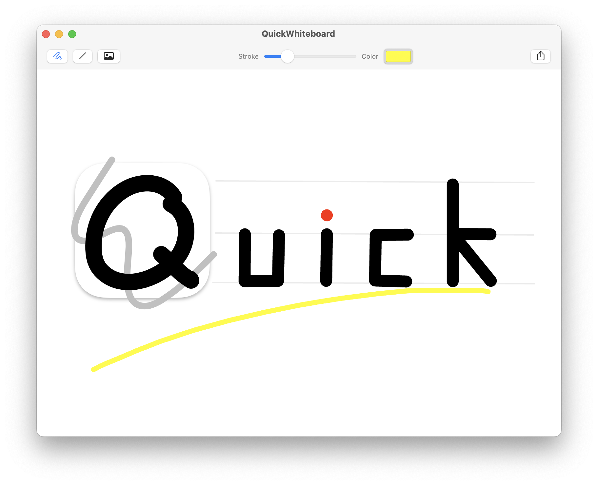

# QuickWhiteboard

> A lightweight whiteboard app for macOS / 一款 macOS 上的轻量白板应用

## Features / 特性

- Infinite canvas / 无边画布
    - Use trackpad, or scroll wheel to change viewport, or drag viewport with right mouse button / 使用触控板或者鼠标滚轮来改变视区，或者使用鼠标右键拖拽来改变
- Unlimited undo and redo / 无限制的撤销和重做
- Import images from pasteboard, drag and drop, continuity camera / 使用粘贴板、拖拽、连续互通相机来导入图片
- Export canvas via copy or system sharing service / 拷贝画布或者使用系统分享服务导出画布

## Basic Tools / 基本工具

- Draw freehand / 徒手画
- Draw line / 画直线
    - Press Shift to draw horizontal, vertical and diagonal lines / 按住 Shift 键来画水平、垂直和对角线
- Erase drawings / 擦出绘画
- Insert Image / 插入图片

## Compatibility / 兼容性

- macOS 11+
- Only Apple Silicon Macs supported / 仅支持 Apple Silicon Mac

## Screenshot / 运行截图

## License

[Mozilla Public License 2.0](./LICENSE)